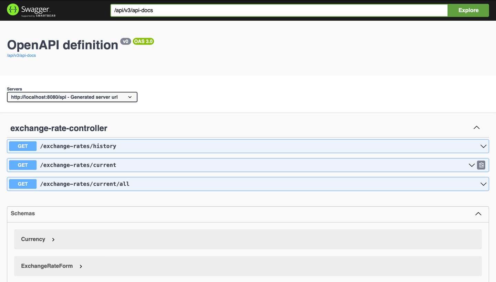
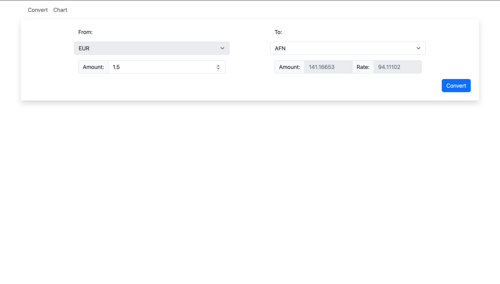
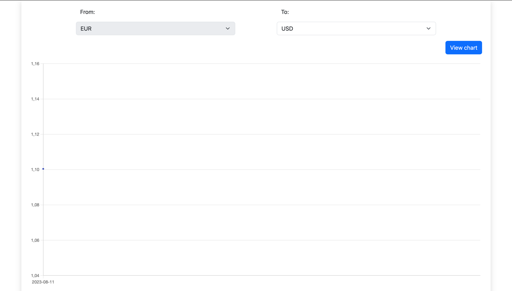
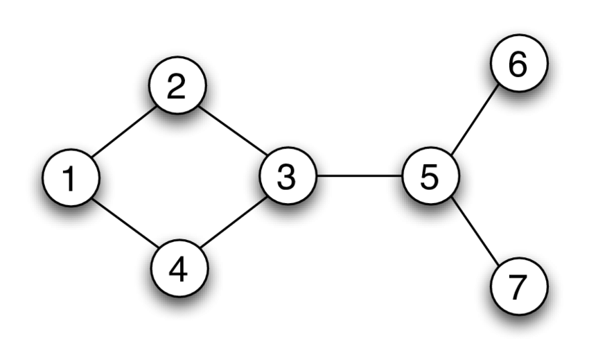

# Introduction
This application allows you to get the exchange rate, as well as to view the history of the exchange rate.

Exchange rate data is stored in a database, Third Party API is used to get exchange rates. The data is updated in the database every day using **Quartz Scheduler**

The project was created as a technical assignment for SEB Savings & Investments tribe


## Technical Stack
Front-End
- Angular
- Bootstrap
- ChartJS

Back-End
- Spring Data JPA
- Spring MVC
- Quartz Schedule
- QueryDSL
- MapStruct
- Lombok

Database
- H2


# Run instruction

### Docker Compose
The project uses Docker with Docker Compose for containerization and deployment the application

Command for running the application via Docker Compose:  
```docker-compose up ```

Docker Compose creates Docker containers for every part of the application.
If containers should be deleted, use Docker Compose command:  
```docker-compose down```


### Default URL addresses

- Back-End: ```http://localhost:8080```
- Front-End:```http://localhost:4200```

# Entry points

[Swagger-UI](http://localhost:8080/api/swagger-ui/index.html) (The back-end should be run)



# Implementation

The application consists of two pages, one of which allows you to convert the amount of one currency to another.

The second page provides a history of exchange rate changes between the euro and the currency of your choice

## Convert page

This page allows you to get the exchange rate between euros and currencies of your choice.

Data about available currencies is requested by Frontend from Backend.




## Chart page
**ChartJS** library is used to display the history of exchange rates between currencies, as well as its implementation for Angular - **ng-chartjs**.





# Unrealised ideas

The idea was to implement the ability to convert between currencies that do not have a direct entry in the database by finding the optimal path in the graph where each node is a different currency

If we imagine that the database record is a non-directed graph. It is possible to find the exchange rate between two currencies that are not directly related to each other

